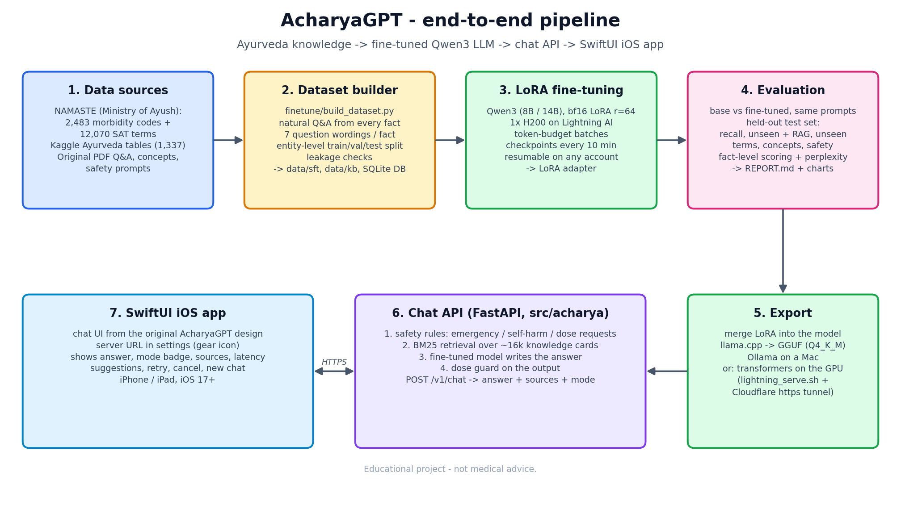

# AcharyaGPT

An Ayurveda assistant: **Qwen3-14B fine-tuned with LoRA** on the Ministry of Ayush NAMASTE
terminology and Ayurvedic knowledge tables,
with a small BM25 retrieval layer, served to a **SwiftUI iOS app**. Based on
[danushkhanna/AcharyaGPT](https://github.com/danushkhanna/AcharyaGPT) (a LangChain + OpenAI
RAG demo over one PDF). Educational only - not medical advice.



(Diagram source: `scripts/make_flow_diagram.py`.)

## Why the previous training showed no improvement

| Problem in the old code | Fix |
|---|---|
| The training answer was a **copy of the passage in the prompt** (`answer = context + " [1]"`; 95% five-word overlap), so the model learned to copy text, nothing else. Sushruta OCR "questions" were literally `"... passage 1533"`. | New dataset (`finetune/build_dataset.py`): natural answers to real questions; 86% closed-book, so facts must be learned. |
| Copy loss drops to ~0 immediately, so early stopping ended training after a few hundred steps. | 3 full epochs (~3,200 steps), cosine schedule, best validation checkpoint kept. |
| Evaluation put the reference in the prompt and measured word overlap with it. | Held-out test: new question wordings + entirely unseen conditions, scored on the *fact* (style-independent), base vs fine-tuned on identical prompts. |
| The app never showed the model: the server answered with extracted source sentences unless a DeBERTa verifier approved every claim. Later commits disabled training entirely. | The API sends the question (+ retrieved entries) to the fine-tuned model and returns its answer with sources. |
| iOS read the server URL from a custom `INFOPLIST_KEY_*` setting that Xcode never writes into Info.plist, so every request failed with "backend URL not configured". | URL set in the app (gear icon), default `http://127.0.0.1:8000`. |

The old 10k-line pipeline was removed; it is still in the git history (commit `9e85eb1`).

## Run it on Lightning AI (one CPU step, one GPU step)

Everything that does not need a GPU runs first on a CPU Studio. Every script can be
re-run safely: finished steps are skipped and training resumes from its last checkpoint.
Round-1 results in `artifacts/run/` are left untouched; round 2 writes to `artifacts/run2/`.

**1. CPU Studio (free) - about 30 minutes**

```bash
cd /teamspace/studios/this_studio/acharyagpt      # round-1 checkout (new account: git clone it)
git fetch origin && git checkout kiro/round2-namaste-14b && git pull
bash scripts/lightning_cpu_setup.sh
```

This script:
- installs the locked environment;
- downloads Qwen3-14B (29.5 GB) and checks every shard's SHA-256;
- verifies the dataset and the prompt/label masking with the real tokenizer;
- builds the SQLite database;
- runs the unit tests and a full train → evaluate → report → merge pass on a tiny model.

It must end with `CPU SETUP COMPLETE`.

**2. Switch the same Studio to 1× H200 - about 2-2.5 hours**

```bash
cd /teamspace/studios/this_studio/acharyagpt && bash scripts/lightning_gpu_run.sh
```

The steps are: preflight, memory probe, LoRA training, base vs fine-tuned evaluation, report,
then the merged model. Training prints an ETA after 20 steps and has a hard limit of
`max_train_minutes` (115).

The run is in its own background session, so closing the tab or pressing Ctrl+C only stops
the log view. Run the same command again to re-attach.

**Checkpoints and moving to another account.** A resume point is saved every ~10 minutes,
and `artifacts/run2/recovery/recovery-latest.tar` holds a portable copy (~6 GB). To continue
on another Lightning account:
1. Clone the same branch there.
2. Run step 1.
3. Upload the tar (Studio file browser).
4. Run `bash scripts/restore_and_resume.sh recovery-latest.tar`.
5. Run step 2.

Alternatively, set `ACHARYA_HUB_REPO=<you>/acharya-recovery` and `HF_TOKEN` before step 2.
Every archive is then also uploaded to that private Hugging Face repo, and the new account
uses `restore_and_resume.sh hub`.

**8B instead of 14B** (faster; ~5 GB GGUF for a Mac with 8 GB RAM): prefix both commands
with `ACHARYA_CONFIG=configs/train_8b.yaml`.

**3. (Optional) demo the app straight from the GPU:** `bash scripts/lightning_serve.sh`
prints an `https://….trycloudflare.com` URL; paste it into the app (gear icon).

**4. Download the results, then switch to CPU.** `artifacts/run2/results-bundle.tar`
contains the adapter, report and evaluation. On CPU, run `bash scripts/export_gguf.sh` to
get `artifacts/gguf/` (Q4_K_M: ~9 GB for 14B; the Mac needs 16 GB RAM).

## Run the app on a Mac (no GPU needed)

1. Install [Ollama](https://ollama.com/download) and copy the downloaded `gguf` folder to
   `artifacts/gguf/` in this repo.
2. `bash scripts/mac_serve.sh` (creates the `acharyagpt` Ollama model and starts the API
   on `http://127.0.0.1:8000`; use `--lan` for a real iPhone on the same Wi-Fi).
3. Open `AcharyaGPT(iOS)/AcharyaGPT(iOS).xcodeproj` in Xcode 15+, pick an iPhone
   simulator, press Run. For a real iPhone, select your team under Signing & Capabilities
   and set the server URL to the Mac's IP in the app's settings.

Check the server without the app:

```bash
curl -s localhost:8000/v1/chat -H 'Content-Type: application/json' \
  -d '{"message":"Which dosha is predominant in Ardita?","history":[]}'
```

## What is trained and how it is evaluated

* **Model:** Qwen/Qwen3-14B (pinned revision, thinking disabled).
  - bf16 LoRA r=64/α=128 on all attention and MLP projections.
  - lr 1.5e-4 cosine, 2 epochs; loss on answer tokens only.
  - `configs/train.yaml`.
* **GPU efficiency:** round 1 ran at ~40% GPU utilization. Round 2 changes:
  - token-budget batches of ~16k tokens with <5% padding;
  - no gradient checkpointing unless a memory probe on the worst batch needs it;
  - fused AdamW, LoRA dropout off, background data workers;
  - tokens/s logged in `metrics.jsonl`.
* **Data:** 88k training conversations about ~15,900 NAMASTE terms and Kaggle conditions,
  plus concepts and safety examples; see [DATASET_CARD.md](DATASET_CARD.md).
* **Test set (2,242 questions).** The headline is **generalization**: questions about
  conditions or terms never trained on.
  - *Unseen + RAG*: answered from retrieved entries.
  - *Unseen terms*: infer what a never-seen Sanskrit term means from word parts learned
    on other terms. Terms that appear anywhere in training are removed.

  Also reported: knowledge recall with new wordings, concepts, safety, and an unknowable
  control. The base and fine-tuned models are the same weights with the adapter off/on and
  get identical prompts. Scoring (`finetune/metrics.py`) checks the stated fact, not the
  wording, and echoing the question's term earns nothing.
* **Serving:**
  1. Safety rules first: emergencies, self-harm and dose requests get fixed replies, and
     generated doses are removed.
  2. BM25 top-3 entries, if the match is confident.
  3. The model, with the same prompt format as training (`src/acharya/prompting.py`).

## Repository

```
finetune/      build_dataset, namaste, database, check_data, download_model, preflight,
               train, recovery, evaluate, metrics, report, export, smoke
src/acharya/   prompting (shared prompt), retrieval (BM25), safety, generation
               (transformers / Ollama), service, api (FastAPI), cli
scripts/       lightning_cpu_setup.sh, lightning_gpu_run.sh, restore_and_resume.sh,
               lightning_serve.sh, export_gguf.sh, mac_serve.sh, ios_device_run.sh
docs/          pipeline_flow.png
data/          (see data/README.md) sft/ (train/validation/test .jsonl.gz), kb/cards.jsonl, raw/namaste/,
               curated/, dataset V1.0.pdf; db/acharya.sqlite is built, not committed
AcharyaGPT(iOS)/  SwiftUI app + tests
```

Local checks: `uv sync --frozen --extra train --extra data --group dev && uv run pytest -q`.
Rebuild the dataset: `uv run python -m finetune.build_dataset` (identical output).
